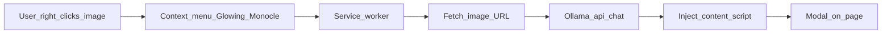

# Glowing Monocle

A Chromium extension (Manifest V3) that analyzes images in the browser using a local [Ollama](https://ollama.com/) chat API with vision support. Works in Chrome, Brave, and other Chromium-based browsers.

## Features

- **Image context menu**: right-click an image and choose **Glowing Monocle**.
- **In-page modal** after analysis: **Formatted** view (lightweight markdown-style rendering) and **Raw JSON** tab, **Copy JSON**, and dismiss via close or backdrop click.
- **Prompts** (in `service-worker.js`): detailed description, categories/tags, hex color palette, anomalies/hallucinations, and NSFW indication, with markdown-oriented output.

## How it works



The service worker fetches the image bytes, sends them to Ollama as base64 in a `/api/chat` payload, then calls into the injected `content.js` helpers to show loading state and results.

## Requirements

- **Ollama** running locally with a **vision-capable** model. The extension defaults to model **`gemma4:e2b`** in `service-worker.js`; install a matching model if you use that default, for example:

  ```bash
  ollama run gemma4:e2b
  ```

  See [Gemma models on Ollama](https://ollama.com/library/gemma4) or the [model search](https://ollama.com/search) for other vision-capable tags; keep the `model` value in `service-worker.js` in sync with what you pull.

- **CORS for extensions**: start Ollama with origins that allow the extension origin.

  Unix-like systems or macOS:

  ```bash
  OLLAMA_ORIGINS=chrome-extension://* ollama serve
  ```

  Windows (Command Prompt):

  ```bat
  set OLLAMA_ORIGINS=chrome-extension://*
  ollama serve
  ```

- Verify Ollama is up: open [http://localhost:11434/api/tags](http://localhost:11434/api/tags).

## Install the extension

1. Clone this repository.
2. Open `chrome://extensions/`.
3. Enable **Developer mode**.
4. Click **Load unpacked** and select the repository root (the folder that contains `manifest.json`).
5. Ensure the `icons/` directory matches the paths in `manifest.json` (required for a clean load).

There is **no** npm/yarn build: load the folder as-is.

## Usage

1. Open a page that shows images (same-origin or remote URLs the browser can load).
2. **Right-click the image** (not the toolbar icon).
3. Choose **Glowing Monocle** from the context menu.
4. Wait for the overlay; use **Formatted** / **Raw JSON** tabs and **Copy JSON** as needed.

The toolbar action does not open a popup in the current manifest; the entry point is the **image** context menu only.

## Configuration

- **Model name** and **API URL** are set in `service-worker.js` (the `fetch` to `http://localhost:11434/api/chat` and the `model` field in the JSON body). Change both there if you use another host, port, or model.
- The worker sends an `Authorization: Bearer XXX` header. Local Ollama typically ignores it; if you point at a gateway that requires a token, replace the placeholder in code (do not commit real secrets).

## Privacy and permissions

- Image bytes are sent to whatever chat endpoint you configure (by default, your machine’s Ollama at `localhost:11434`).
- The manifest includes broad `http://*/*` and `https://*/*` host permissions so the service worker can `fetch()` arbitrary image URLs when you use the context menu on those images.

## Project layout

| Path | Role |
|------|------|
| `manifest.json` | MV3 manifest, permissions, web-accessible assets |
| `service-worker.js` | Context menu, image fetch, Ollama request, orchestration |
| `content.js` | Modal UI logic, formatted rendering helper, copy |
| `content.html` / `content.css` | Modal markup and styles |
| `icons/` | Toolbar and extension icons |
| `vendor/marked.umd.js` | Vendored [Marked](https://marked.js.org/) (v16.3.0); exposed for extension resource loading but **not** used for the formatted tab today |
| `result.html` / `result.js` | Standalone debug-style page; not referenced by the manifest |

## Third-party

- **Marked** (v16.3.0) is bundled under `vendor/marked.umd.js`. The **Formatted** tab is rendered by a small in-page converter in `content.js` (`simpleMarkdownToHtml`), not by Marked, unless you change the implementation later.

## License

See [LICENSE](LICENSE).
